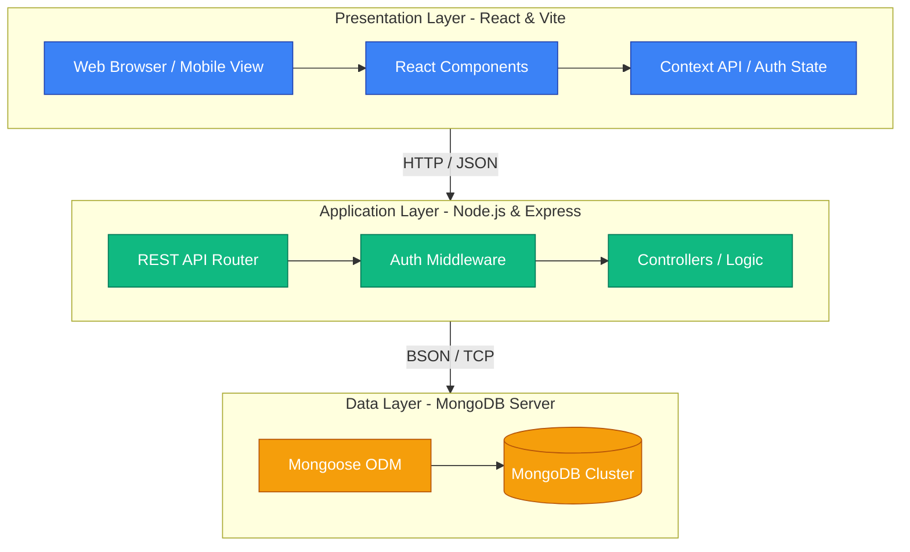
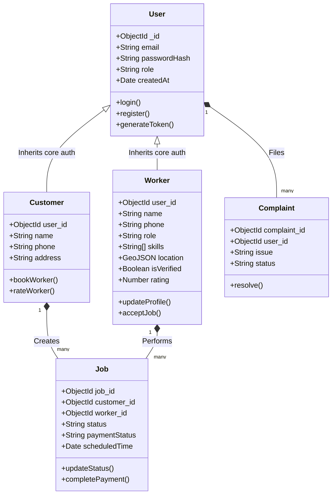
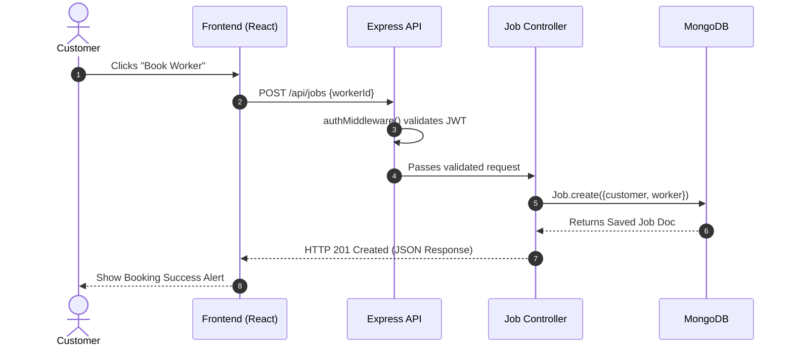
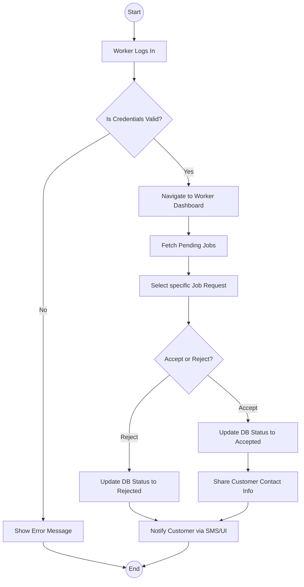
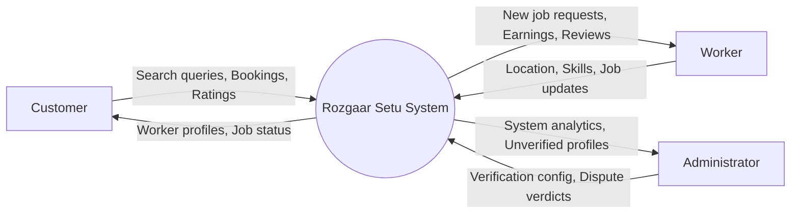
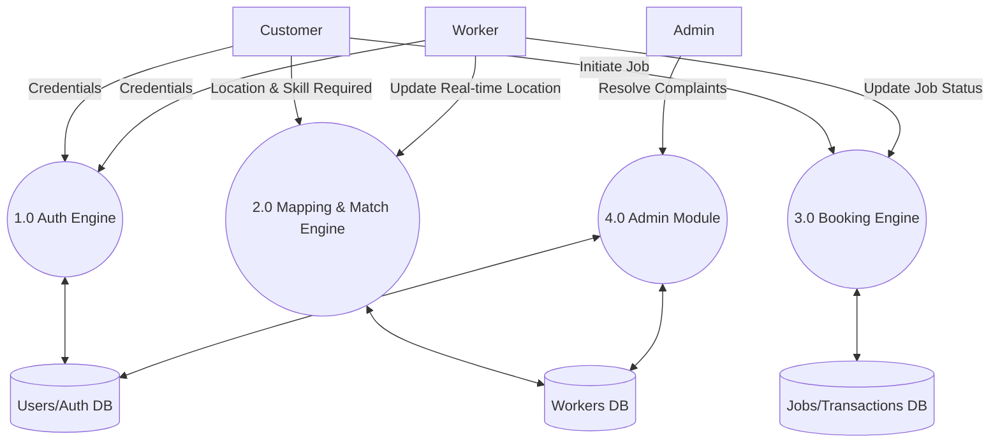
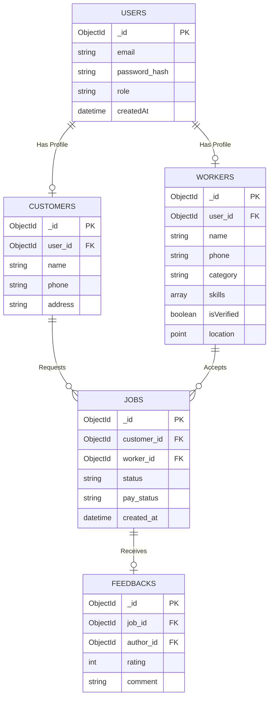

# RozgaarSetu System Diagrams

Below are the 8 requested diagrams generated using Standard Mermaid.js syntax. You can paste these code blocks into [Mermaid Live Editor](https://mermaid.live/) or view them in any Markdown previewer that supports Mermaid (like VS Code or GitHub).

---

## Fig 4.1 System Architecture Diagram



---

## Fig 4.2 Use Case Diagram

```mermaid
usecaseDiagram
actor Customer as "Customer"
actor Worker as "Worker"
actor Admin as "Administrator"

rectangle "Rozgaar Setu System" {
    usecase UC1 as "Register / Login"
    usecase UC2 as "Search Worker by Proximity"
    usecase UC3 as "Update Profile & Location"
    usecase UC4 as "Send Job Request"
    usecase UC5 as "Accept / Reject Job"
    usecase UC6 as "Provide Feedback & Rating"
    usecase UC7 as "Verify Worker Identity"
    usecase UC8 as "View Platform Analytics"
    usecase UC9 as "Manage Complaints"
}

Customer --> UC1
Customer --> UC2
Customer --> UC3
Customer --> UC4
Customer --> UC6

Worker --> UC1
Worker --> UC3
Worker --> UC5

Admin --> UC1
Admin --> UC7
Admin --> UC8
Admin --> UC9
```

---

## Fig 4.3 Class Diagram



---

## Fig 4.4 Sequence Diagram



---

## Fig 4.5 Activity Diagram



---

## Fig 4.6 DFD Level 0 (Context Diagram)



---

## Fig 4.7 DFD Level 1



---

## Fig 4.8 Entity Relationship Diagram (ERD)


